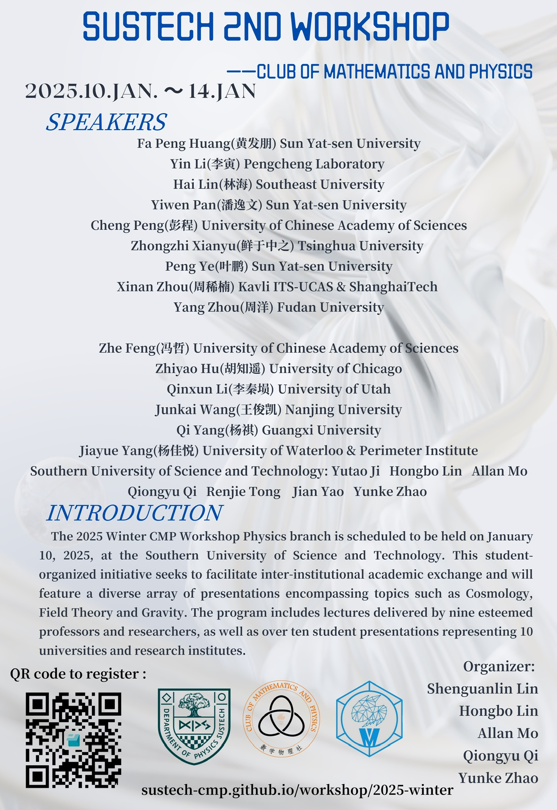
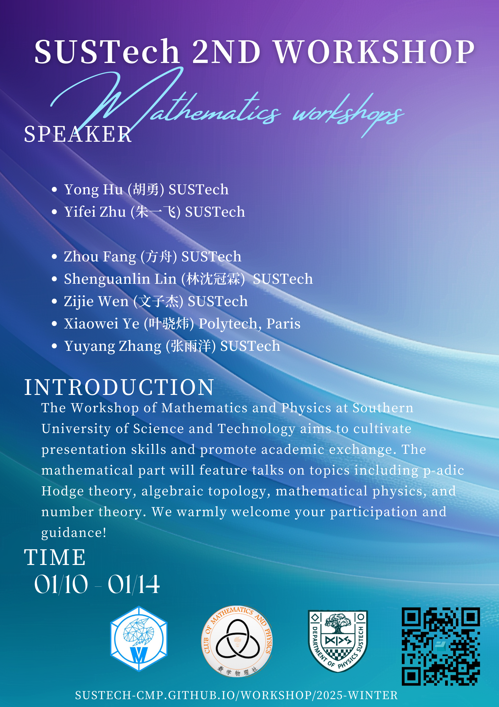

# SUSTech Club of Mathematics and Physics Workshop - 2025 Winter

## Physics Branch

The 2025 Winter CMP Workshop Physics branch is scheduled to be held on January 10, 2025, at the Southern University of Science and Technology. This student-organized initiative seeks to facilitate inter-institutional academic exchange and will feature a diverse array of presentations encompassing topics such as Cosmology, Field Theory, Quantum Information and Gravity. The program includes lectures delivered by nine esteemed professors and researchers, as well as over ten student presentations representing 10 universities and research institutes.

### Speakers

> We feel very sad to announce Mr. Yin Li's abscence due to urgent affairs.

#### Professors & Researchers

- **Fa Peng Huang 黄发朋** _Sun Yat-sen University_
- **Hai Lin 林海** _Southeast University_
- **Yiwen Pan 潘逸文** _Sun Yat-sen University_
- **Cheng Peng 彭程** _University of Chinese Academy of Sciences_
- **Zhongzhi Xianyu 鲜于中之** _Tsinghua University_
- **Peng Ye 叶鹏** _Sun Yat-sen University_
- **Xinan Zhou 周稀南** _Kavli ITS-UCAS & ShanghaiTech_
- **Yang Zhou 周洋** _Fudan University_

#### Students

- **Zhe Feng 冯哲** _University of Chinese Academy of Sciences_
- **Zhiyao Hu 胡知遥** _University of Chicago_
- **Qinxun Li 李秦埙** _University of Utah_
- **Junkai Wang 王俊凯** _Nanjing University_
- **Qi Yang 杨祺** _Guangxi University_
- **Jiayue Yang 杨佳悦** _University of Waterloo & Perimeter Institute_
- _Southern University of Science and Technology_
  - **Yutao Ji 冀宇韬**
  - **Hongbo Lin 林宏博**
  - **Allan Mo 莫雨波**
  - **Qiongyu Qi 祁琼宇**
  - **Renjie Tong 佟仁杰**
  - **Jian Yao 姚健**
  - **Yunke Zhao 赵云柯**

### Timetable

<table>
    <thead>
        <tr>
            <th style="text-align:center">Jan. 10</th>
            <th style="text-align:center">Jan. 11</th>
            <th style="text-align:center">Jan. 12</th>
            <th style="text-align:center">Jan. 13</th>
            <th style="text-align:center">Jan. 14</th>
        </tr>
    </thead>
    <tbody>
        <tr>
            <td style="text-align:center">9:30-10:30 冀宇韬</td>
            <td style="text-align:center" rowspan=2>10:00-12:00 李秦埙</td>
            <td style="text-align:center">9:30-10:30 杨佳悦</td>
            <td style="text-align:center">9:45-10:45 佟仁杰</td>
            <td style="text-align:center" rowspan=2>10:00-12:00 王俊凯 (20)</td>
        </tr>
        <tr>
            <td style="text-align:center">11:00-12:00 鲜于中之</td>
            <td style="text-align:center">11:00-12:00 潘逸文</td>
            <td style="text-align:center">11:00-12:00 胡知遥</td>
        </tr>
        <tr>
            <td style="text-align:center" colspan=5>Lunch</td>
        </tr>
        <tr>
            <td style="text-align:center">14:00-15:00 周洋</td>
            <td style="text-align:center">13:30-14:00 莫雨波</td>
            <td style="text-align:center">13:30-15:00 祁琼宇</td>
            <td style="text-align:center">14:00-15:00 彭程</td>
            <td style="text-align:center" rowspan=2>14:00-16:00 林海</td>
        </tr>
        <tr>
            <td style="text-align:center" rowspan=2>15:30-17:00 叶鹏</td>
            <td style="text-align:center">14:15-15:15 黄发朋</td>
            <td style="text-align:center">15:30-16:30 周稀南</td>
            <td style="text-align:center">15:30-16:30 姚健</td>
        </tr>
        <tr>
            <td style="text-align:center">15:45-17:45 杨祺</td>
            <td style="text-align:center">16:45-17:45 冯哲</td>
            <td style="text-align:center">16:45-17:45 赵云柯</td>
            <td style="text-align:center">16:30-17:30 林宏博</td>
        </tr>
        <tr>
            <td style="text-align:center" colspan=5>Dinner</td>
        </tr>
        <tr>
            <td style="text-align:center">19:00-20:00 王俊凯 (5)</td>
            <td style="text-align:center">-</td>
            <td style="text-align:center">-</td>
            <td style="text-align:center">-</td>
            <td style="text-align:center">-</td>
        </tr>
    </tbody>
</table>

### Topics

> Listed in time order

#### 1. From Ladder Operator to Supersymmetry Quantum Mechanics - Yutao Ji (冀宇韬)

**Abstract:** TBA

**Biography:** TBA

#### 2. Recent progress in cosmological collider and cosmological amplitudes - Zhong-Zhi Xianyu (鲜于中之)

**Abstract:** The studies of cosmological collider physics and cosmological amplitudes have attracted much attention from the particle, cosmology, and amplitude communities in recent years. This program aims at probing fundamental new particles and new interactions at the inflation scale, through the observation of large-scale fluctuations of our universe. In this talk, I shall introduce the basic idea of cosmological collider physics and our recent progress in the analytical study of cosmological amplitudes.

**Biography:** Zhong-Zhi Xianyu is an associate professor at the Department of Physics, Tsinghua University. He obtained his Ph.D. in 2015 from Tsinghua University and was a postdoc at Harvard University from 2015 to 2020. He works in theoretical particle physics and cosmology. His recent research interests include cosmological collider physics, quantum field theory and amplitude techniques in curved spacetime, new physics in the early universe and in astrophysical systems, gravitational wave astronomy, etc.

#### 3. TBA - Yang Zhou (周洋)

**Abstract:** TBA

**Biography:** TBA

#### 4. A short introduction to effective field theory of topological orders in higher dimensions - Ye Peng (叶鹏)

**Abstract:** In 3+1D and higher dimensions, spatially nonlocal objects such as loops and membranes are topological excitations of topologically ordered phases, exhibiting emergent phenomena that do not exist in 2+1D. In this talk, I will show how to study topological orders in 3+1 and higher via effective field theory which is in general topological field theory of some kinds. If time permitted, the talk will cover the following topics:

1. field theory construction
2. braiding
3. fusion
4. quantum dimension
5. shrinking
6. pentagon equations, shrinking-fusion hexagon equations and diagrammatic representation.

Reference: arXiv:2405.19077.

**Biography:** Peng Ye is currently a professor of physics at School of Physics, Sun Yat-sen University. He received his B.S. at Sun Yat-sen University in 2007 and Ph.D at Institute for Advanced Study, Tsinghua University in 2012. During 2012-2015, he worked at Perimeter Institute for Theoretical Physics as a postdoctoral researcher; During 2015-2018, he worked at the Anthony Leggett Institute for Condensed Matter Theory at UIUC as a postdoctoral research associate and Gordon & Betty Moore fellow. In August 2018, he began to work at Sun Yat-sen University as a professor and lead a research team focusing on quantum many-body theory and cutting edge frontier of exotic phases of matter via quantum-information-perspectives.

#### 5. The Art of Dimensional Analysis & Estimation Calculus - Junkai Wang (王俊凯)

**Abstract:** One of the essences of physics lies on the art of approximation & simplification.   "Fly by Night Physics", by Prof. Anthony Zee, has been recently translated by Prof. Yang Ji into Chinese. It is an engaging  interdisciplinary resource to dimensional analysis and approximation methods across various physics domains - from classical to quantum physics, from water waves to particle collisions. Students from diverse academic stages & disciplines could gain some valuable insights during reading this book.

In this presentation,  we will explore the fundamentals of dimensional analysis and commonly used approximation techniques.  Following that, we'll delve into the book's key concepts with illustrating examples.  Contents from related textbooks written by 孙博华, 赵凯华, 梁灿彬, 曹周键 et al. will be mentioned.  A famous disscusion about fundamental constants by Duff, Okun, Veneziano will also be included. (arxiv: physics/0110060)

Attendees are expected to have a basic understanding of colledge-level physics,  and many website recourse would be find useful for this topic.

**Biography:** J.W. receives his undergraduate education @School of Physics, Nanjing University and currently serves as a visiting student @YMSC, Tsinghua University.

#### 6. Introduction to observational cosmology: geometric constraints - Qinxun Li (李秦埙)

**Abstract:** This is a very concentrated introduction to cosmology. In this talk, I will introduce most of basic ideas of modern cosmology. We will start with the simplest formulation to the universe in the general relativity, then derive the equations of motion of background spacetime (Freedman equations). After that, the fundamentals of dark matter and dark energy will be introduced. With the cosmological models in hand, I will derive the distance-redshift relations and talk about the geometric probes of cosmology: Supernova and Baryon Acoustic Oscillation. I would suggest audience to watch my previous talk in this workshop (available on bilibili)

**Biography:** Qinxun Li is a second year graduate student in Department of Physics and Astronomy, University of Utah. He works with Prof. Kyle Dawson on Baryon Acoustic Oscillation (BAO). He involves in the BAO analysis of Dark Energy Spectroscopic Instrument. Before that, he got his bachelor degree in astronomy from University of Science and Technology of China.

#### 7. Axions: From theoretical prediction to dark matter candidates - Allan Mo (莫雨波)

**Abstract:** TBA

**Biography:** TBA

#### 8. Brewing the Universe: Understanding Dark Matter Mechanisms and Gravitational Wave Signals through Coffee-Making Analogies - Fa Peng Huang (黄发朋)

**Abstract:** TBA

**Biography:** TBA

#### 9. Dark matter, dark energy and their impact on large-scale structure of the Universe - Qi Yang (杨祺)

**Abstract:** Dark matter and dark energy have become important scientific topics. It is one of the most important frontier scientific topics in physics today. In this lecture, we review the main research history of dark matter and dark energy, give a brief introduction to the main dark matter and dark energy models, and outline the impact of dark matter and dark energy on the formation and evolution of large-scale structures in the universe. The study of ultralight axion dark matter is an important topic at present, and we will briefly present some of our new work.

**Biography:** Yang Qi is a second-year graduate student at the School of Physical Science and Engineering Technology of Guangxi University, engaged in the research of cosmology, astrophysics and theoretical physics.

#### 10. From black hole thermodynamics to black hole chemistry - Jiayue Yang (杨佳悦)

**Abstract:** Over the past five decades, noteworthy progress has been made in black hole thermodynamics. With thermodynamic pressure and volume properly defined, the thermodynamic phase space can be extended. In this theoretical framework of black hole chemistry, a variety of rich thermodynamic and chemical phenomena, such as black hole phase transitions, triple points, and Van der Waals-like behaviour have been discovered. Here we carry out the first investigation of the dynamics of the recently discovered multicriticality in black holes. We specifically consider black hole quadruple points in D = 4 Einstein gravity coupled to non-linear electrodynamics. We observe thermodynamic phase transitions between the four stable phases at the quadruple point by numerically solving the Smoluchowski equation.

**Biography:** YANG Jiayue is currently a PhD student in Applied Math at the University of Waterloo, Canada. She graduated with a Bachelor's degree in Physics from the Tang Aoqing Honors Program at Jilin University, China, receiving the Dean's Scholarship. She completed her Master's in the Department of Physics and Astronomy at the University of Waterloo. Her research interests include high-energy physics and gravitational physics, with a focus on black hole thermodynamics, quantum information, and holography. She is also passionate about teaching and science outreach, with over 12,000 followers on her Bilibili channel.

#### 11. Holomorphic quasi-modular bootstrap, defects and mirror symmetry - Yiwen Pan (潘逸文)

**Abstract:** Classifying conformal field theory is an interesting topic in both theoretical physics and mathematics. In this talk we will discuss a particular approach to classifying 2d chiral symmetry algebra of 2d CFTs, referred to as the holomorphic (quasi)-modular bootstrap. Such an approach has intriguing connection to 4d $\mathcal{N} = 2$ superconformal field theories, non-local operators and geometry of Hitchin system moduli space.

**Biography:** Yiwen Pan received his Bachelor degree from Sun Yat-sen University, and later the doctoral degree in physics from Stony Brook University. He worked as a postdoc in Uppsala University in Sweden, and later joined the School of Physics at Sun Yat-sen University. His research interests center around supersymmetric field theory, exactly computable observables and dualities, conformal field theory and chiral algebra, and related topics in mathematical physics.

#### 12. AdS/CFT correspondent from the point of view of Stress Tensor and Conservation Current - Qiongyu Qi (祁琼宇)

**Abstract:** In this lecture, I will focus on AdS Gravity from the point of view of Stress Tensor and other conservation current. I will revisit the basic facts about the quasilocal stress tensor and the asymptotic symmetry in gravitational systems. Then I will discuss the correspond between Long-Range Force and CFT currents. Finally I will propose a procedure for computing the boundary stress tensor associated with a gravitating system in asymptotically AdS space (AdS3 and AdS5). Via the AdS/CFT correspondence, the result is interpretable as the expectation value of the stress tensor in a quantum conformal field theory. The two dimensional stress tensor transforms with a Schwarzian derivative and the expected central charge. We also find a nonzero ground state energy for global AdS5, and show that it exactly matches the Casimir energy of the dual N=4 super Yang-Mills theory on S3×R.

**Biography:** TBA

#### 13. Holographic correlators from analytic bootstrap - Xinan Zhou (周稀楠)

**Abstract:** Holographic correlators are basic observables for exploring and exploiting the AdS/CFT correspondence. However, computing them using traditional methods is notoriously difficult. In this talk, I will give a general introduction to a modern program of holographic correlators where these difficulties are circumvented by using analytic conformal bootstrap techniques. I will review some of the important progress and outline a number of future directions.

**Biography:** Prof. Xinan Zhou did his undergraduate studies at University of Science and Technology of China, and obtained his PhD from the C. N. Yang Institute for Theoretical Physics at Stony Brook University in 2018. From 2018 to 2021, he was a postdoc fellow at the Princeton Center for Theoretical Science in Princeton University. He joined the Kavli Institute for Theoretical Sciences in University of Chinese Academy of Sciences in 2021 and has also been a visiting Assistant Professor at ShanghaiTech University since 2023. Prof. Zhou has published more than 30 papers with over 2000 citations. He has made original contributions to the computation of conformal correlators in the context of AdS/CFT and the development of new analytic tools for studying conformal field theories. He was awarded the 2023 ICTP Prize for these contributions.

#### 14. Noether's Theorem and AdS3 Gravity - Zhe Feng (冯哲)

**Abstract:** In this work, we revisit the approach with the covariant phase space formalism for the asymptotic symmetry analysis in the pure AdS3 gravity. We modify the approach to a version which is exactly in the framework of Noether's theorem. The key point in the modification is to take a systematical treatment of the boundary effects.

In particular, we start from defining the pure AdS3 gravity in Lagrangian formalism, where we adopt proper asymptotic boundary conditions, and we take holographic renormalization in the off-shell level. We then follow Noether's theorem step by step with a careful treatment of the boundary terms.

Following our modified approach, we get the following two results. First, we show that the asymptotic symmetries are indeed symmetries of the pure AdS3 gravity in the sense of Noether's theorem. Second, we compute the associated charges of the asymptotic symmetries with the expression of Noether charge, which reproduces the same result from the ordinarily used approach with the covariant phase space formalism.

**Biography:** Zhe Feng is a Master's student under the supervision of Prof. Jie-qiang Wu at the Institute of Theoretical Physics, Chinese Academy of Sciences. He obtained his B.Sc. in Physics from Hohai University in 2024. His research focuses on the AdS/CFT correspondence and quantum gravity.

#### 15. A Brief Introduction to Quantum Geometry - Renjie Tong (佟仁杰)

**Abstract:** In this lecture, we will frist introduce the general setting of quantum geometry in order to reveal that the imaginary part of quantum geometry tensor is excatly the Berry curvature. Then we will review the basic concepts such as the Berry phase and the Berry curvature. Finally, we will show the implication of quantum geometry both in semiclassical wave packet dynamics and the Perturbation theories based on the ac Hall effect.

**Biography:** TBA

#### 16. Quantum Metrology with Many-Body States - Hu Zhiyao (胡知遥)

**Abstract:** Quantum metrology aims to leverage quantum mechanical effects to improve the performance of parameter estimation with the limited resources, while many-body entanglement is usually introduced to assist in this process. However, how to generate desired many-body states, how to make better use of many-body states in sensing are open questions in this area. In this talk, I will present our latest works on improving precision with quadratic collective-spin interaction, improving precision and robustness using non-gaussian states, as well as rapidly generating GHZ(-like) states.

Ref: Phys. Rev. A.108.023722, Phys. Rev. Letters 132, 113402 (2024), Chinese Phys. B 33 080601

**Biography:** Mr. Zhiyao Hu is currently a first year PhD student in the Pritzker School of Molecular Engineering at the University of Chicago. He earned his Bachelor of Science in Physics from Xi’an Jiaotong University in 2024. During his sophomore year, he began his undergraduate research in quantum optics under the guidance of Prof. Fu-li Li at XJTU. He then furthered his research experience by joining Prof. Yong-Chun Liu’s group at Tsinghua University as a research intern, where he focused on spin squeezing and quantum metrology. In his junior year, he was invited to MIT as a visiting undergraduate scholar in Prof. Paola Cappellaro’s group, and later, he served as a junior research associate in Prof. Haidong Yuan’s group at the Chinese University of Hong Kong, where his work centered on quantum control and multiparameter estimation. His research interests are at the intersection of atomic, molecular, and optical (AMO) physics and quantum information science.

#### 17. Chaos and SYK-like models - Cheng Peng (彭程)

**Abstract:** We will briefly discuss chaotic behaviors in various SYK-like models and analyze some examples illustrating the integrable-chaotic transition in these models. 

**Biography:** Cheng Peng graduated from the Yuanpei College of Peking University and got his Ph.D. degree from the University of Michigan, Ann Arbor under the supervision of Prof. Henriette Elvang. He then worked at ETH Zurich, Brown University, and UC Davis. He joined the Kavli Institute for Theoretical Sciences (KITS) at the University of Chinese Academy of Sciences (UCAS) in September 2020. His research interest lies in the intersection of quantum field theory, gravity, and string theory. Recently, he has been focusing on higher-spin theories and ensemble average theories.

#### 18. Can GPT Speak the Quantum Language? - Jian Yao (姚健)

**Abstract:** In this talk, I will briefly introduce our work of ShadowGPT, a novel approach for solving quantum many-body problems by learning from randomized measurement data collected from quantum experiments. The model is a generative pretrained transformer (GPT) trained on simulated classical shadow data of ground states of quantum Hamiltonians, obtained through randomized Pauli measurements. Once trained, the model can predict a range of ground state properties across the Hamiltonian parameter space. We demonstrate its effectiveness on the transverse-field Ising model and the  cluster-Ising model, accurately predicting ground state energy, correlation functions, and entanglement entropy. This approach highlights the potential of combining quantum data with classical machine learning to address complex quantum many-body challenges.

Ref: J. Yao, Y.-Z. You, ShadowGPT: Learning to Solve Quantum Many-Body Problems from Randomized Measurements, arXiv:2411.03285

**Biography:** Mr. Jian Yao received his Bachelor of Science in Physics from Southern University of Science and Technology (SUSTech). He is currently working as a research assistant at SUSTech. He has conducted research on network Bell nonlocality (with Prof. Jingyun Fan at SUSTech), computational materials science (with Prof. Chunjing Jia at the University of Florida), and AI for quantum learning (with Prof. Yi-Zhuang You at UC San Diego). His research interests include quantum learning, nonlocality, and quantum-enhanced applications.

#### 19. Conservation Charge in Curved Space-time: From Static Space-time to Asymptotic Symmetry - Yunke Zhao (赵云柯)

**Abstract:** TBA

**Biography:** TBA

#### 20. An Introduction to Blackhole Thermodynamics - Junkai Wang (王俊凯)

**Abstract:** Why is falling into a black hole a one-way journey?  How can this be reconciled with our knowledge about quantum theory which is intrinsically reversible?  Is information truly lost along with the infalling observer? Does a white hole exist? Those are general questions about blackhole physics but can be strictly considered and rigorously modeled. 

Theoretical physics community in the past half century has witnessed remarkable progress in understanding the quantum nature of black holes, inspired by advances in supersymmetry, holographic duality, string theory, quantum information and other fields. Recent work has demonstrated a promising picture that there's possibility to understand realistic black hole as a quantum gravity system. The quantum physics of black holes naturally reconciles general relativity and statistical mechanics,  describing as a "thermodynamic theory" at a semiclassical level. 

The audience should have foundational knowledge of quantum physics and statistical mechanics as a prerequisite. As some further explorations, readers may find it helpful to consult arXiv:2006.06872, arXiv:2201.03096, and arXiv:2410.14414 (also famous lecture series taught by Hartman, Hong Liu, Susskind, ....).  Our main reference will be arxiv:2412.16795 "Introduction to Black Hole Thermodynamics" recently released by the prominent theorical physicist Prof. Edward Witten.

#### 21. TBA - Hai Lin (林海)

**Abstract:** TBA

**Biography:** TBA

#### 22. TBA - Hongbo Lin (林宏博)

**Abstract:** TBA

**Biography:** TBA

---

## Math Branch

The Workshop of Mathematics and Physics at SouthernUniversity of Science and Technology aims to cultivatepresentation skills and promote academic exchange. Themathematical part will feature talks on topics including p-adicHodge theory, algebraic topology, mathematical physics, andnumber theory.We warmly welcome your participation and
guidance!

### Speakers

#### Professors

- **Yong Hu 胡勇** _Southern University of Science and Technology_
- **Yifei Zhu 朱一飞** _Southern University of Science and Technology_

#### Students

- **Zhou Fang 方舟** _Southern University of Science and Technology_
- **Shenguanlin Lin 林沈冠霖** _Southern University of Science and Technology_
- **Zijie Wen 文子杰** _Southern University of Science and Technology_
- **Yuyang Zhang 张雨洋** _Southern University of Science and Technology_
- **Xiaowei Ye 叶骁炜** _Polytech, Paris, To Be Confirmed_

### Timetable

**TBA**

### Topics

#### 1. TBA - Zijie Wen (文子杰)

**Abstract:** TBA

#### 2. A general introduction to intersection homology - Zhou Fang (方舟)

**Abstract:** In recent years, intersection homology has become an indispensable tool for studying the topology of singular spaces. While the main results of usual homology theories often fail for singular spaces, intersection homology effectively recovers these properties, bridging this critical gap. In this talk, I will present the foundational concepts of GM intersection homology (including simplicial intersection homology, PL intersection homology, and singular intersection homology) and some examples. Finally, I may explore the topic of non-GM (Goresky-MacPherson) intersection homology. 

Reference: Singular intersection homology, Greg Friedman, [https://www.cambridge.org/core/books/singular-intersection-homology/5F44CE866BA329E31D9AE92E7F9392BE](https://www.cambridge.org/core/books/singular-intersection-homology/5F44CE866BA329E31D9AE92E7F9392BE)

#### 3. Explicit examples of Higgs bundles in the contexts of quantum materials and geometric Langlands correspondence - Yifei Zhu (朱一飞)

**Abstract:** We discuss the topology, geometry, and physics of explicit examples of rank-2 and rank-3 Higgs bundles, as eigenbundles associated to gapless quantum mechanical systems.  In particular, we explain why hyperbolic band theory (after A.J. Kollár et al.) and such gapless non-Hermitian systems are natural from the mathematical viewpoint of Higgs bundles.  Moreover, afforded by such systems, we explain how the physical bulk–edge correspondence may have a mathematical origin of the Langlands correspondence, as evidenced by the respective roles played by Higgs bundles.

#### 4. An introduction to p-adic hodge theory - Shenguanlin Lin (林沈冠霖)

**Abstract:** In this talk, I will provide an introduction to p-adic Hodge theory. Specifically, I will give an overview of p-adic representation theory, focusing on the theory of (phi, Gamma)-modules and Sen's theory. Additionally, we will discuss certain p-adic representations that arise from geometry. We will explore how the theory of periods rings is used to classify these representations.

#### 5. 二次型的算术 - Yong Hu (胡勇)

**Abstract:** 本报告介绍我所了解的有关二次型算术的一部分研究课题和进展。

#### 6. TBA - Yuyang Zhang (张雨洋)

**Abstract:** TBA

## Registration

We welcome teachers/students from other colleges and institutes to attend offline. Please fill in the registration form for college entrance and further affairs.

## Online Attendance

We will host real-time online meetings, and recordings will be uploaded to [bilibili](https://space.bilibili.com/2050647467). For in-time annuncement, please join the QQ Group

## Contact

Yunke Zhao

- Cellphone: 19935182993
- e-mail: [12210129@mail.sustech.edu.cn](mailto:12210129@mail.sustech.edu.cn)
- QQ: 2267065543
