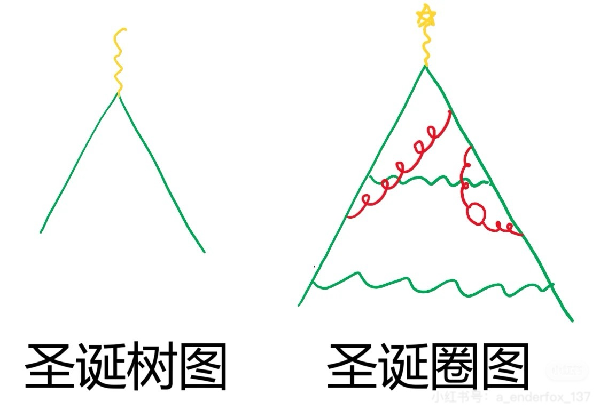

# T-Break Day 1

## Tree-Break

_圣诞节虽然已经过去了，但这很有趣，不是吗？_

还在为你的圣诞树过于平凡，缺乏特点而苦恼吗？是的，圣诞树的时代早已落幕了！

**隆重介绍——圣诞圈！**

_来源：网图_

看！多么美丽！

> 免责声明：本公司生产的圣诞圈图与量子场论中的圈图无实际关联。使用者在尝试计算散射振幅过程中产生的头晕、头痛、躁郁等症状，本公司概不负责。

### 题目要求

找出圣诞圈图的圈数。图中上方，左下方与右下方对应于该图的三条外线，上方的星星不计入图中。

### 附加题

1. 设计（并分享）更好看的圣诞圈图！
2. 假设圈图中实直线为电子，试计算圣诞圈图的 QED 散射振幅。 _真的会有人算吗？_
